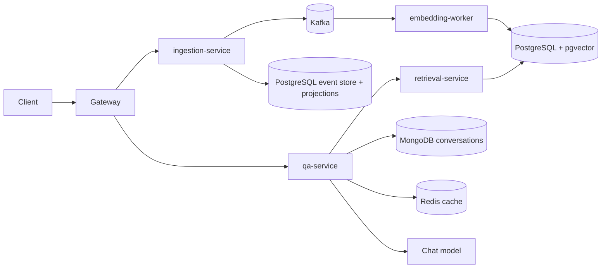

# RAG Help Center

A backend-only reference project for a versioned, AI-powered help center, built with Kotlin and the current Spring ecosystem. It combines a focused event-sourced article lifecycle with CQRS projections, Kafka-driven indexing, hybrid retrieval, and citation-grounded Q&A.

The project is at **Phase 0 (buildable foundation)**. Business implementation starts with the article command slice in Phase 1.

## Architecture



| Module | Port | Role |
|---|---:|---|
| `gateway` | 8080 | Public Spring Cloud Gateway boundary |
| `ingestion-service` | 8081 | Article commands, event store, CQRS projections, outbox |
| `embedding-worker` | 8082 | Kafka-driven chunking and vector indexing |
| `retrieval-service` | 8083 | Internal HTTPS/JSON hybrid retrieval API |
| `qa-service` | 8084 | Grounded Q&A and conversation history |
| `domain-kernel` | — | Small pure-Kotlin shared primitives |

The detailed rationale is in [the architecture document](docs/rag-knowledge-base-design.md); executable phases and acceptance criteria are in [the implementation plan](docs/rag-knowledge-base-implementation-plan.md).

## Technology baseline

- Java 25 and Kotlin 2.4.10
- Spring Boot 4.1.0, Spring Cloud 2025.1.2, Spring AI 2.0.0
- Maven 3.9.16 through the checked-in wrapper
- PostgreSQL/pgvector, MongoDB, Redis, Kafka, optional Ollama
- Jib images, Kubernetes/Helm, Prometheus/Loki/Tempo/Grafana

## Prerequisites

- JDK 25
- Docker with Compose v2

No system Maven installation is required.

## Build

Windows:

```powershell
.\mvnw.cmd -B -ntp verify
```

Linux/macOS:

```bash
./mvnw -B -ntp verify
```

`verify` runs tests, ktlint, and detekt. Apply Kotlin formatting with `./mvnw ktlint:format`.

## Local infrastructure

Start the required data and messaging services:

```bash
docker compose up -d postgres redis mongodb kafka
```

Ollama is optional until the embedding and Q&A phases. Start it through the profile and pull the models chosen by that phase:

```bash
docker compose --profile ai up -d ollama
```

Run one service with its local profile:

```bash
./mvnw -pl ingestion-service spring-boot:run -Dspring-boot.run.profiles=local
```

Default local credentials are deliberately disposable and confined to `docker-compose.yml`. Kubernetes and non-local profiles obtain secrets externally.

## Design highlights

- `KnowledgeArticle` is event sourced because revision and publication history have domain value; Kafka remains an integration transport, not the event store.
- CQRS read projections serve article/status queries and vector retrieval.
- `qa-service` calls `retrieval-service` through a Spring HTTP Service client over a versioned internal REST contract; gRPC is not used.
- A separate Admin API and Config Server were removed: admin commands belong with the article aggregate, while Kubernetes supplies configuration and service discovery.
- AI-dependent integration tests use deterministic fakes by default, keeping CI free of API keys and model downloads.

## Container images

Each executable module uses Jib. Build into the local Docker daemon with:

```bash
./mvnw -pl ingestion-service -am package jib:dockerBuild
```

Registry publishing uses `fra.ocir.io/${OCIR_NAMESPACE}/rag-help-center/<module>` and external Docker/Jib credentials. CI does not publish images during Phase 0.
